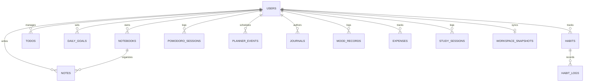

# Entity Relationship Diagram — Smart Book

The PostgreSQL schema in `database/schema.sql` models user-scoped productivity entities all linked to `users(id)` with cascading deletes and indexing.

```mermaid
erDiagram
    USERS ||--o{ NOTEBOOKS : owns
    USERS ||--o{ NOTES : writes
    NOTEBOOKS ||--o{ NOTES : organizes
    USERS ||--o{ TODOS : manages
    USERS ||--o{ DAILY_GOALS : sets
    USERS ||--o{ HABITS : tracks
    HABITS ||--o{ HABIT_LOGS : records
    USERS ||--o{ POMODORO_SESSIONS : logs
    USERS ||--o{ PLANNER_EVENTS : schedules
    USERS ||--o{ JOURNALS : authors
    USERS ||--o{ MOOD_RECORDS : logs
    USERS ||--o{ EXPENSES : tracks
    USERS ||--o{ STUDY_SESSIONS : logs
    USERS ||--o| WORKSPACE_SNAPSHOTS : syncs
```
